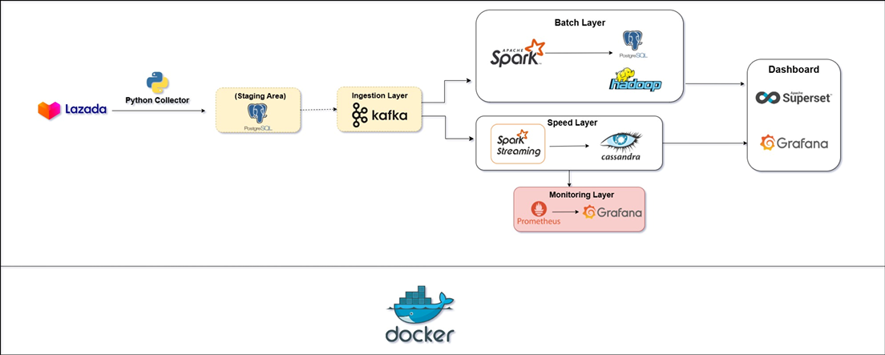

# Lazada/Tiki Data Engineering Pipeline

A graduation-project data engineering pipeline for collecting product data, storing it in PostgreSQL, streaming it through Kafka/Spark, persisting analytical outputs to HDFS/Cassandra, and monitoring the stack with Prometheus/Grafana/Superset.

## Architecture



The pipeline follows a Lambda-style data architecture: Lazada product data is collected by a Python ingestion layer, staged in PostgreSQL, streamed through Kafka, processed by Spark batch and streaming jobs, persisted to PostgreSQL, HDFS, and Cassandra, and served through Superset and Grafana dashboards. Prometheus and Grafana provide the monitoring layer for pipeline and infrastructure health.

## Project Layout

```text
.
├── src/                  # Python pipeline source code
│   ├── main.py           # Orchestrates ETL, producer, and Spark consumer
│   ├── tiki_etl.py       # API extraction and PostgreSQL loading
│   ├── db_to_kafka.py    # Database-to-Kafka utility
│   ├── kafka_producer/   # Kafka producer modules
│   ├── spark_consumer/   # Spark streaming consumer modules
│   └── metrics/          # Prometheus metrics helpers
├── scripts/              # Operational and one-off scripts
├── sql/                  # Database schemas and seed SQL/CQL
├── data/raw/             # Raw/sample datasets used by the project
├── monitoring/           # Prometheus, Grafana dashboards, alerts, SQL queries
├── config/               # Hadoop, Kafka, Spark, PostgreSQL, Kerberos config
├── nifi/                 # NiFi local configuration/runtime mount
├── superset/             # Superset local metadata mount
├── docs/                 # Reports, templates, screenshots, school requirements
├── tools/                # Tool-specific project files, e.g. DataGrip
└── runtime/              # Generated logs, caches, warehouse/checkpoint artifacts
```

## Prerequisites

- Python 3.9+
- Docker Desktop / Docker Compose
- Java 8 for local Spark/Hadoop runs
- Windows Hadoop utilities if running Spark locally on Windows

## Setup

```powershell
python -m venv .venv
.\.venv\Scripts\Activate.ps1
pip install -r requirements.txt
Copy-Item .env.example .env
Copy-Item hadoop.env.example hadoop.env
```

Fill in `.env` with database credentials, Kafka connection, Cassandra connection, and Lazada API credentials.

## Run Infrastructure

```powershell
docker compose --profile infra up -d
```

Useful local endpoints:

- Prometheus: http://localhost:9090
- Grafana: http://localhost:3000
- NiFi: http://localhost:8080/nifi
- Superset: http://localhost:8088
- HDFS NameNode UI: http://localhost:9870

## Run Pipeline

```powershell
python src/main.py
```

For one-off utilities:

```powershell
python src/db_to_kafka.py
python scripts/init_superset.py
```

## Notes For Further Hardening

- Align Kafka topic names across producer and consumer. Current code references `tiki-products`, `lazada-products`, and `lazada_data` in different modules.
- Move hard-coded Windows paths in `src/main.py` and `src/spark_consumer/tiki_consumer.py` into `.env` variables.
- Keep `.env`, `hadoop.env`, local DB files, logs, caches, and runtime folders out of Git.
- Consider splitting extraction, loading, streaming, and monitoring code into clearer Python packages once the pipeline is stable.

